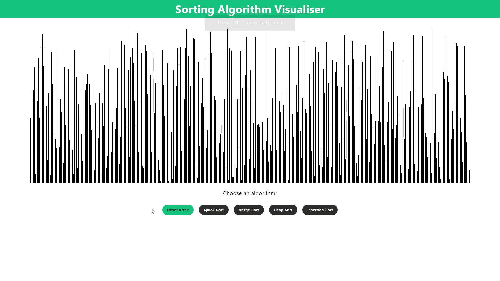

# Sorting Algorithm Visualiser

An interactive ReactJS web application that visualises sorting algorithms and displays their complexities.
Quick, merge, heap and insertion sort are implemented with JavaScript.
[View the deployed project here](https://conorjmcnamara.github.io/sorting-visualiser).

[](https://conorjmcnamara.github.io/sorting-visualiser)

## Installation

### Prerequisites
- Node.js and npm - [install](https://nodejs.org/)

### Running the Application
Input the following commands into the command line:

```bash
# Clone the repository
$ git clone https://github.com/conorjmcnamara/sorting-visualiser.git

# Change directory
$ cd sorting-visualiser

# Install dependencies
$ npm install

# Start the development server
$ npm start
```

Open [http://localhost:3000](http://localhost:3000) to view it in the browser.

## Resources
- [React](https://reactjs.org/)
- [Quick Sort](https://en.wikipedia.org/wiki/Quicksort)
- [Merge Sort](https://en.wikipedia.org/wiki/Merge_sort)
- [Heap Sort](https://en.wikipedia.org/wiki/Heapsort)
- [Insertion Sort](https://en.wikipedia.org/wiki/Insertion_sort)