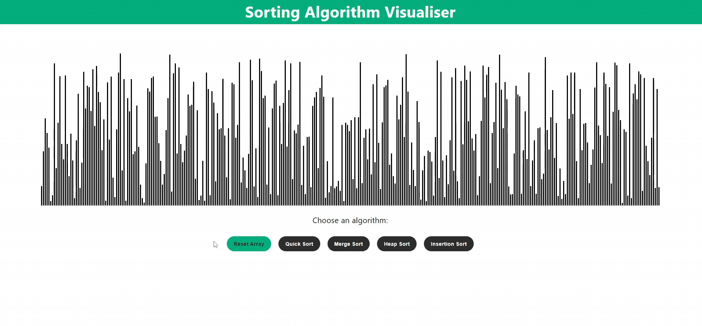

# Sorting Algorithm Visualiser

An interactive ReactJS web application that visualises sorting algorithms and displays their complexities.
Quick, merge, heap and insertion sort are implemented with JavaScript.

## Resources
- [ReactJS](https://reactjs.org/)
- [Quick Sort](https://en.wikipedia.org/wiki/Quicksort)
- [Merge Sort](https://en.wikipedia.org/wiki/Merge_sort)
- [Heap Sort](https://en.wikipedia.org/wiki/Heapsort)
- [Insertion Sort](https://en.wikipedia.org/wiki/Insertion_sort)